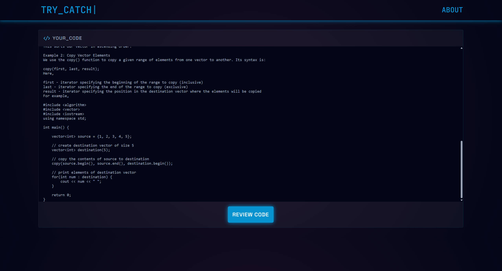
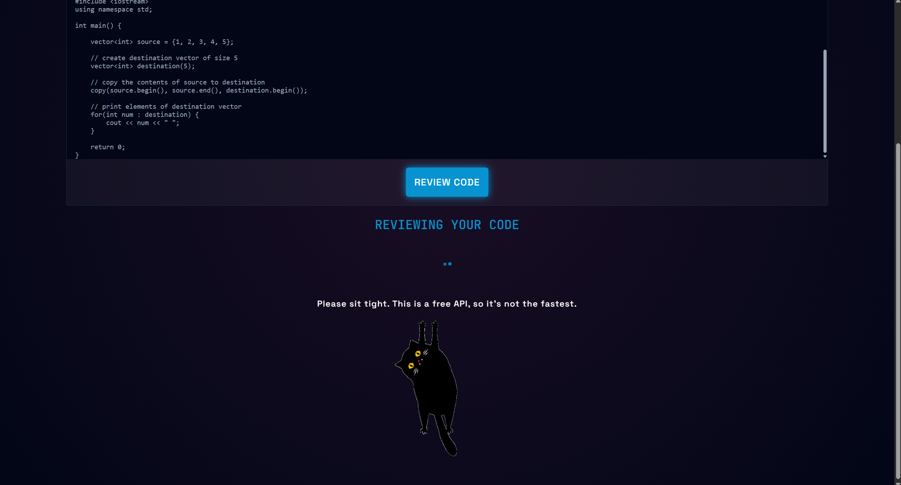
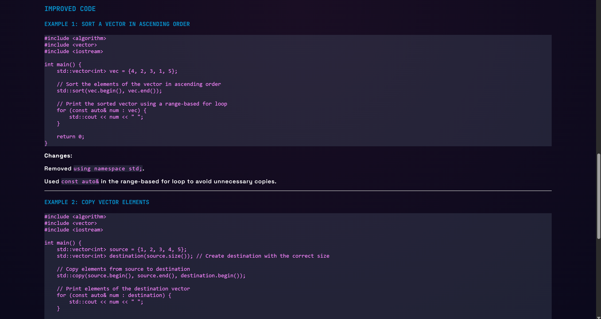

[](https://github.com/thuongtruong109/icoziv)

<!-- PROJECT LOGO -->
<br />
<div align="center">
  <a href="https://github.com/ivanaogrizovic/trycatch">
    
  </a>

  <p align="center">
    An AI powered code reviewer
    <br />
    <a href="https://github.com/ivanaogrizovic/trycatch"><strong>Explore the docs »</strong></a>
    <br />
    <br />
    <a href="https://trycatch-topaz.vercel.app/">View Demo</a>
  </p>
</div>

<!-- TABLE OF CONTENTS -->
<details>
  <summary>Table of Contents</summary>
  <ol>
    <li>
      <a href="#about-the-project">About The Project</a>
      <ul>
        <li><a href="#built-with">Built With</a></li>
      </ul>
    </li>
    <li>
      <a href="#getting-started">Getting Started</a>
      <ul>
        <li><a href="#prerequisites">Prerequisites</a></li>
        <li><a href="#installation">Installation</a></li>
      </ul>
    </li>
    <li><a href="#usage">Usage</a></li>
    <li><a href="#license">License</a></li>
    <li><a href="#contact">Contact</a></li>
  </ol>
</details>

<!-- ABOUT THE PROJECT -->

## About The Project



A React-based code review tool powered by the Cohere API.
It processes user-submitted code and returns concise feedback on readability, structure, and best practices.

Built to explore integrating LLMs into developer workflows.

### Built With

- React
- CSS
- Vercel
- Cohere AI

<p align="right">(<a href="#readme-top">back to top</a>)</p>

<!-- GETTING STARTED -->

## Getting Started

Follow these steps to set up the project locally and connect it to the Cohere API using Vercel.

### Prerequisites

Make sure you have the following installed:

- Node.js (v18 or later)
- npm

```sh
npm install npm@latest -g
```

### Installation

#### 1. Create a Cohere API Token

- Go to the Cohere dashboard
- Sign up or log in
- Navigate to the API Keys section
- Generate a new API key

⚠️ Keep this token secure — you’ll use it as an environment variable.

#### 2. Set Up a Vercel Account

- Go to Vercel and create an account

- Install the Vercel CLI (optional but recommended):

```sh
npm install -g vercel
```

- Log in via CLI:

```sh
vercel login
```

#### 3. Clone the Repository

```sh
git clone https://github.com/ivanaogrizovic/trycatch.git
cd trycatch
```

#### 4. Add Environment Variable in Vercel

- In your Vercel dashboard, create a new project (or import your repo)
- Go to Project Settings → Environment Variables
- Add your Cohere API key:

```sh
Name: COHERE_API_KEY
Value: your_api_key_here
```

- Save and deploy your project

#### 5. Install Dependencies

```sh
npm install
```

#### 6. Run the project

Start both the React app and Vercel:

```sh
vercel dev
```

<p align="right">(<a href="#readme-top">back to top</a>)</p>

<!-- USAGE EXAMPLES -->

## Usage

You can use this app to get a code review on any programming language.

Please be aware that it's leveraging a <b>free LLM</b>, so the response times can be a quite long at times.But they do come through! 😊





<p align="right">(<a href="#readme-top">back to top</a>)</p>

## License

This is a project made for fun and to explore leveraging LLMs.

Don't claim it as your own.

The LLM is provided by [Cohere AI](https://cohere.com/).

[](https://github.com/40ants/ai-badges)

<p align="right">(<a href="#readme-top">back to top</a>)</p>

<!-- CONTACT -->

## Contact

You can find me on [LinkedIn](https://www.linkedin.com/in/ivana-ogrizovic/).

Project Link: [https://github.com/ivanaogrizovic/trycatch](https://github.com/ivanaogrizovic/trycatch)

Demo Link: https://trycatch-topaz.vercel.app/

[](https://www.linkedin.com/in/ivana-ogrizovic/)
[](https://github.com/ivanaogrizovic/)

<p align="right">(<a href="#readme-top">back to top</a>)</p>
